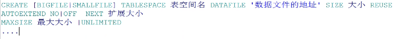

# 复习：表空间创建：

表空间：是数据库中用来保存数据的最上层的一种逻辑概念，但是数据库中的具体的数据其实是保存在表空间中的
数据文件中，数据文件是一个物理文件，是在磁盘上真实存在的。

数据文件和表空间的关系：

一个表空间至少要有一个数据文件，但是最多只能有1024个数据文件。一个数据文件只能属于一个表空间。

### 表空间分类：

#####    1.小文件表空间：smallfile,再创建表空间的时候如果没有指定表空间的类型则默认为小文件表空间。

​       特点：小文件表空间中允许有多个数据文件（最多1024个），每一个数据文件最大空间32G.

#####    2.大文件表空间：bigfile

​       特点：大文件表空间中只允许有一个数据文件，该数据文件最大可以保存32T的数据。

### 系统默认表空间：

#####   1.EXAMPLE:样例表空间，主要用来保存数据库中提供的一些样例数据。

#####   2.SYSTEM:系统表空间，主要用来保存数据库中的一些数据字典信息，以及系统管理员的对象信息。

#####   3.SYSAUX:系统辅助表空间。

#####   4.TEMP:临时表空间，主要用来保存一些临时数据。

#####   5.UNDO:撤销表空间，主要用来保存数据库中的修改或者是删除的一些数据。

#####   6.USERS:用户表空间，主要就是用来保存用户的一些应用程序的信息。


#### 创建语法：  

```plsql
CREATE [BIGFILE|SMALLFILE] TABLESPACE 表空间名 DATAFILE '数据文件的地址' SIZE 大小 REUSE
AUTOEXTEND NO|OFF  NEXT 扩展大小
MAXSIZE 最大大小 |UNLIMITED 
....
```


#### --创建表空间sys用户

```sql
CREATE TABLESPACE tbs_01 DATAFILE 'D:\大数据班级\3.正式课程\3.sql文件\tbs_01.dbf' SIZE 10m REUSE
AUTOEXTEND ON NEXT 5m
MAXSIZE 1g; 
```


#### --新增数据文件

```plsql
ALTER TABLESPACE tbs_001 ADD DATAFILE 'D:\dbf\tbs_011.dbf' SIZE 10m REUSE;
```

#### --删除数据文件

```plsql
ALTER TABLESPACE tbs_001 DROP DATAFILE 'D:\dbf\tbs_011.dbf';
```

注意：在进行表空间维护的时候，可以给小文件表空间中添加数据文件，但是不能给大文件表空间中添加数据文件。

​      可以删除小文件表空间中的数据文件，但是不能删除表空间创建的时候一起创建的那个数据文件。


表空间包含用户模式包含数据表：

逻辑存储+时机存储

用户所拥有的的表==》存在表空间中

用户所创建的数据表==》属于各用户，即模式


用户.模式

scott.schema			--固定写法，代表用户模式

