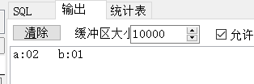

1.如果是命令窗口就用exec 存储过程名：

```plsql
EXEC  procedure; --procedure是存储过程名
```

 2.如果是  SQL窗口就用 begin  存储过程名  end; 

```plsql
begin

  procedure;--procedure是存储过程名

end;
```

 3.如果是程序中调用就用 call 存储过程名 ，举个栗子：
```plsql
hibernateDao.excuteSqlUpdate("{Call proc_stuInfo()}");//存储过程proc_stuInfo
```

4、带 in out 类型的参数执行  （oracle 存储过程 交换两个变量的值）
        先定义变量赋值后 再调用执行  例如：

```plsql
declare 
     a  varchar2(20):= '01';
     b  varchar2(20):='02';
   --  a= '01' ;b='02';
begin  
    exchange(a ,b);
```


```plsql
--存储过程定义 
create or replace procedure exchange(a in out varchar2, b in out varchar2) is
   v_b varchar2(30);
   -- a  varchar2(30);
   --b  varchar2(30);
begin

   v_b :=a;   
   a := b; 
   b := v_b; 
   dbms_output.put_line('a:'||a||'   b:'||b);

end exchange;

--执行
declare 
     a  varchar2(20):= '01';
     b  varchar2(20):='02';
   --  a= '01' ;b='02';
begin  
    exchange(a ,b);
END;
```


结果：



5.存储过程中调用存储过程 
直接写存储过程名就行

```plsql
procedure; --procedure是存储过程名
```

