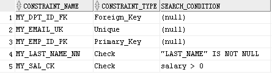

# 一、oracle中对表有五种约束条件

### 完整性约束


非空(not null)

唯一(unique)

主键(primary key)

外键(foreign key)

### check约束

NOT NULL：指定列不能包含空值。

UNIQUE：指定列的值或者列的组合的值对于表中所有的行必须是唯一的。

PRIMARY KEY：表的每行的唯一性标识。

FOREIGN KEY：在列和引用表的一个列之间建立并且强制一个外键关系。

CHECK：指定一个必须为真的条件。

# 二、约束命名

如果不自己给约束起一个名字，oracle会自动为约束命名，形如SYS_Cn(n为一个6位数字)。

给约束起一个名字，可以使约束引用起来更方便：

constraint 约束名字 约束类型

# 三、列级约束和表级约束

列级约束，

指约束定义在字段后面。只涉及单个列，能够定义任何类型的约束。


表级约束，

指约束定义在表的后面。涉及单个列或几个列的组合，能够定义除了not null以外的任何类型的约束。


not null

非空约束只能定义在列级。

# 四、not null 约束

例子：

```
create table TT (

id number(3) not null,

name varchar2(100) constraint TT_NAME_NN not null

);
```

查询约束名称：

```
select owner, constraint_name, constraint_type, table_name from user_constraints where table_name='TT';

OWNER

\--------------------------------------------------------------------------------

CONSTRAINT_NAME C TABLE_NAME

------------------------------ - ------------------------------

HR2

SYS_C009083 C TT

HR2

TT_NAME_NN C TT
```


# 五、unique 约束

1、唯一约束要求被约束的列或列的组合值是唯一的，不能有两个相同值存在。

2、唯一约束可以定义在列级也能定义在表级。表级可以定义字段的组合。

3、唯一约束允许空值，因为空值不等于任何值。

4、组合字段的唯一约束，只要字段的组合不完全一样就可以插入表。

例子：

```
drop table TT;

create table TT (

id number(3),

name varchar2(100),

constraint TT_ID_NAME_UK unique (id, name)

);

insert into TT values (1, 'aaa');

insert into TT values (1, 'bbb');
```

第一条记录和第二条记录虽然第一个字段相同，但第二个字段是不同的，所以能够插入成功。

# 六、primary key 约束

通过主键可以找到唯一一行与之对应的记录。

1、一个表只能有一个主键约束。

2、单一主键定义在列级，组合主键定义在表级。

3、主键不允许空值，不允许出现重复值。

### unique和primary key都有唯一的意思，他们的区别是什么？

1)primary key隐含了必定是唯一的值。

2)unique的列可以为空。primary key不能为空。

3)一个表只能有一个primary key，可以有许多个unique。

4)primary key是用作标记作用，用主键可以找到唯一的一行。并不是说这行的字段值都是唯一的、不同的。

# 注：

因为唯一性是注明约束条件定义的一部分，所以在创建一个或多个主键列的时候，oracle会为主键约束隐式的创建一个唯一索引来强制实现唯一性。

也就是说唯一性是通过创建唯一索引来实现的。oracle对primary key和unique的字段都会自动建立唯一索引。

这个唯一索引和普通的B-tree索引区别就在值的唯一性上，其它查询性能方面都是一样的。

也就是说对于primary key和unique字段不用再手工建立索引了。

对于唯一约束的组合字段，第一列索引走的是range scan，后面的列走的是fast full scan。

# 七、foreign key 约束

一个表的外键必须是，另一个表的主键或唯一键。

外键可以为空值，一个外键值必须匹配一个在父表中存在的值或者空值。

外键可以定义在表级(单列)，列级(单列或列的组合)。

外键必须指向父表的PK字段或UK字段。

例子：

在hr用户下，employees表的department_id引用了departments表的department_id做为外键。

```
constraint EMP_DEPT_FK foreign key (department_id) references departments (department_id)
```

外键被定义在子表中，包含引用列的表是父表。外键用下面关键字的组合定义：

foreign key：被用于在表级约束中定义子表中的列。

references：确定父表中的表和列。

on delete cascade：指出当父表中的行被删除时，子表中相依赖的行也将被级联删除。

on delete set null：当父表的值被删除时，转换外键值为空。

无 on delete cascade 或 on delete set null 选项时，如果父表中的行在子表中引用，则它不能被删除。

# 八、check约束

check约束定义了一个每行都必须满足的条件，类似与在插入数据时，对数据做了一个where过滤。

例子：

在hr用户下，employees表的salary字段，就有check约束。


constraint EMP_SALARY_MIN check (salary > 0)

# 九、约束条件的添加、删除、禁用

表的约束条件只能添加、删除或禁用，不能修改它的结构。

1、添加约束

使用带add子句的 alter table 语句为已经存在的表添加一个约束。

```sql
alter table table_name add [constraint constraint_name] type (column);
```

table_name：表名。

constraint_name：约束的名字。

type：约束的类型。

column：约束的列。

用alter table table_name modify 字句添加一个not null约束。

```
alter table table_name modify colunm constraint constraint_name not null;
```

table_name：表名。

column：约束的列。

constraint_name：约束的名字。

2、删除约束

使用带 drop 子句的 alter table 语句删除一个约束。

```sql
alter table table_name drop constraint constraint_name;
```

table_name：表名。

constraint_name：约束的名字。

3、禁用和启用约束

使用带 disable|enable 子句的 alter table 语句禁用或启用约束。

```
alter table table_name disable|enable constraint constraint_name;
```

table_name：表名。

constraint_name：约束的名字。

# 十、练习

```
drop table employees2;

create table

employees2

(

employee_id number(6),

first_name varchar2(20),

last_name varchar2(25),

email varchar2(25),

phone_number varchar2(20),

hire_date date,

job_id varchar2(10),

salary number(8,2),

commission_pct number(2,2),

manager_id number(6),

department_id number(4)

);

alter table employees2 add constraint MY_EMP_ID_PK primary key (employee_id);

alter table employees2 add constraint MY_DPT_ID_FK foreign key (department_id) references departments(department_id);

alter table employees2 add constraint MY_EMAIL_UK unique (email);

alter table employees2 modify last_name constraint MY_LAST_NAME_NN not null;

alter table employees2 add constraint MY_SAL_CK check (salary > 0);
```


# 十一、not null和check



我们可以看到，在数据字典user_contraints表中，not null的类型也是check约束。

严格上说not null约束是check约束中的一种。