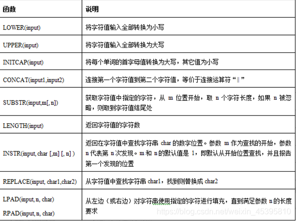
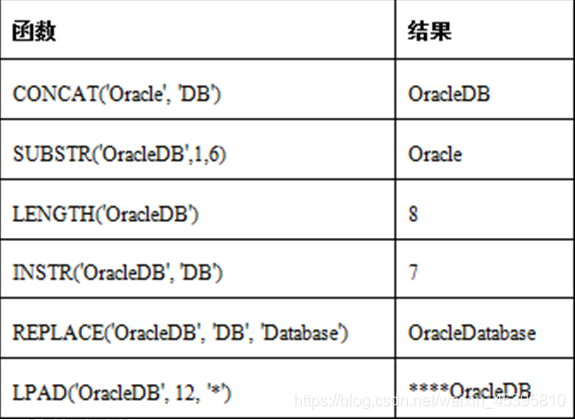
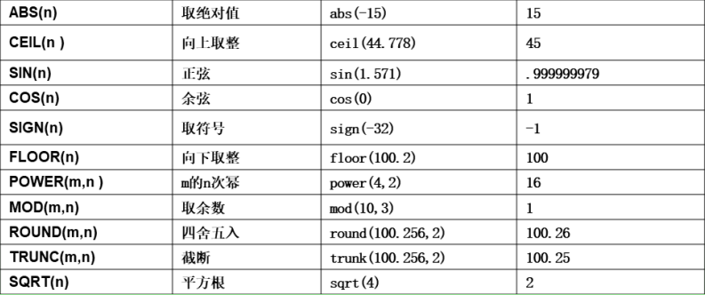
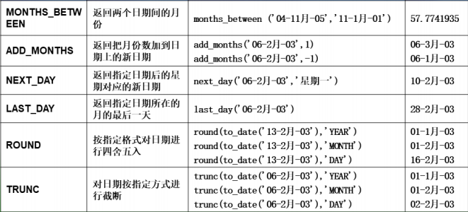

#### sign是一种计算机函数，算法为取数字n的符号,大于0返回1,小于0返回-1,等于0返回0



```
select ltrim ('ilovejavalove', 'ilove') from dual;
```




- ## **数字函数**

数字函数
 Round(参数1,[参数2])
 功能:四舍五入，参数2可选，参数2表示保留几位小数

```
round(24.764, 2) --> 24.76 ;
```

Trunc(参数1,[参数2])
 功能:截断数字(直接忽略),参数2表示截断到的小数位，如果参数2忽略则默认为0

## · **日期函数**

需求1:获得系统当前时间 **sysdate**

```
select sysdate from dual;

```

需求2:想知道雇员表中，部门编号为60的雇员，截止到今天共工作了多少周，则可以使用如下的SQL语句

```
select cname, round((sysdate - hiredate)/7) from emp where deptno = 60;
```

##  **转换函数**

**to_char(参数)**

1. 功能:将指定参数转换成字符

```
select to_char(sal,‘$99,999.9999’) as 工资 from emp;
```

   2.格式化日期格式

	select to_char(hiredate,'YYYY-MM-DD HH:MI:SS') from emp;
	select to_char(sysdate,'YYYY-MM-DD HH:MI:SS') from dual;
	select to_char(sysdate,'YYYY-MM-DD HH24:MI:SS') from dual;
**to_date(参数)**
 \1. 功能:将指定参数转换成date类型

```
/*查询入职日期在‘1981-2-20 12:34:56’	之后的员工的姓名和入职日期*/
select ename,hiredate from emp where hiredate>to_date('1981-2-20 12:34:56','YYYY-MM-DD HH24:MI:SS');
```

**to_number(参数)**

1. 功能:将指定参数转换成number类型

```
select sal from emp	where
sal>to_number('$1,250.00','$9,999.99');

```

## - 通用函数

**NVL（参数1， 参数2）**

1. 功能：如果参数1为null，则返回参数2,如果参数1不为null，则返回参数1 本身。

```
nvl(sal, 0) --> when (sal = null) then 0 esle sal
```

**NVL2(参数1，参数2，参数3)**

1. 功能：如果参数1不为null，则返回参数2，如果参数1为null， 则返回参数3

```
nvl2(sal, 1, 0) -->  when (sal = null) then 0 else 1
```

#### NVL函数的格式如下：NVL(expr1,expr2)

含义是：如果oracle第一个参数为null那么显示第二个参数的值，如果第一个参数的值不为null，
则显示第一个参数本来的值。

```
例如：SQL> select ename,NVL(comm, -1) from emp;
```

#### NVL2函数的格式如下：NVL2(expr1,expr2, expr3)

含义是：如果该函数的第一个参数为null那么显示第三个参数的值，如果第一个参数的值不为null，
则显示第二个参数的值。

```
例如：SQL> select ename,NVL2(comm,-1,1) from emp;
```

**COALESCE函数**

1. 作用:如果表达式1为非空，则返回表达式1的值；如果表达式1为空，则返回表达式2的值，依次类推，如果前面的表达式都为空，则返回表达式n的值

```
/*如果员工有年终奖comm,则返回年终奖数值没有年终奖时，如果有上司则返回上司编号，没有上司则该员工是老板，显示“老板”即可*/
select ename,coalesce(to_char(comm),to_char(mgr),'老板') from emp;


```


## - **练习一：**

1、建立学员表stuInfo和学员成绩表stuMarks
 学员表包括：学员姓名stuName，学号stuNo,性别stuSex，年龄stuAge，地址stuAddress
 成绩表包括：成绩号examNo，学号stuNo,笔试成绩writtenExam，机试成绩labExam
 2、向两个表中分别录入信息

 /*=插入数据练习===*/

```
--向学员信息表stuInfo插入数据--
INSERT INTO stuInfo(stuName,stuNo,stuSex,stuAge,stuAddress)VALUES('张秋丽','s25301','男',18,'北京海淀')
INSERT INTO stuInfo(stuName,stuNo,stuSex,stuAge,stuAddress) VALUES('李斯文','s25303','女',22,'河南洛阳')
INSERT INTO stuInfo(stuName,stuNo,stuSex,stuAge) VALUES('李文才','s25302','男',31)
INSERT INTO stuInfo(stuName,stuNo,stuSex,stuAge,stuAddress) VALUES('欧阳俊雄','s25304','男',28,'新疆威武哈')

--向学员成绩表stuMarks插入数据--
INSERT INTO stuMarks(ExamNo,stuNo,writtenExam,LabExam) VALUES('E0001','s25301',80,58)
INSERT INTO stuMarks(ExamNo,stuNo,writtenExam) VALUES('E0002','s25302',50)
INSERT INTO stuMarks(ExamNo,stuNo,writtenExam,LabExam) VALUES('E0003','s25303',92,97)
INSERT INTO stuMarks(ExamNo,stuNo,writtenExam,LabExam) VALUES('E0004','s25304',98,85)
```

---------------

------------


 --1.查询两表的数据--

```
select * from STUINFO t; 
select* from STUMARKS;
```

 --2.查询男学员名单-- 

```
select * from stuinfo where stusex='男';
```

 --3.查询笔试成绩优秀的学员情况（成绩在75~100之间)-- 

```
select * from stumarks where writtenexam between 75 and 100;
```

 --4.显示学员信息，地址没有填写的显示“地址不详”--

```
select stuname,stuno,stusex,stuage,nvl(stuaddress,'地址不详')as "stuAddress" from stuinfo;
```

 --5.统计笔试考试平均分和机试考试平均分--     ？空值问题

```
select avg(writtenexam)as "avgWrittenExam",avg(nvl(labexam,0))as "avgLabExam" from stumarks;
```

 --6.统计参加本次考试的学员人数 

```
select count(stuName)as"学员人数" from stuinfo; 
```

 --7.查询没有通过考试的人数（笔试或机试小于60分）-- ？空值问题

```
select count(stuno)as"不及格人数" from stumarks where writtenexam<60 or nvl(labexam,0)<60;
```

 --8.查询学员成绩，显示学号，笔试成绩，机试成绩，平均分-- 

```
select stuno,writtenexam,nvl(labexam,0), (writtenexam+nvl(labexam,0))/2 as "平均分" from stumarks;
```

 --9.排名次（按平均分从高到低排序），显示名次、学号、平均分--  ?名次

```
select row_number()over(order by (writtenexam+nvl(labexam,0))/2 desc) as"名次", stuno, 
(writtenexam+nvl(labexam,0))/2 as "平均分" from stumarks order by nvl(labexam,0)/2 DESC;
```

 --10.机试成绩都提5分--

```
select stuno,writtenexam,nvl(labexam,0)+5 as"labExam"  from stumarks;
```

 --11.机试成绩100分封顶（加分后超过100分的，按100分计算）--

```
/*数据是char类型时
select stuno,writtenexam,
(case when nvl(labexam,0)+5>100 then '100+' else cast(nvl(labexam,0)+5 as varchar(6))end)as "labExam"
   from stumarks;
*/
```

 --12.笔试不及格的提到及格，60-90分的加5分，90分以上加3分（但不能超过100）--

```
select stuno,(case when writtenexam<60 then 60 when writtenexam>60 
and writtenexam<90 then writtenexam+5 when writtenexam+3>100 then 100 
else writtenexam+3 end)as "labExam"
   from stumarks;
```

-----------

-----------


## - **练习二：**

以Scott用户登录

--1、选择部门30中的雇员

```
select * from emp where deptno=30;
```

--2、列出所有办事员的姓名、编号和部门

```
select ename,empno,deptno from emp where job='CLERK';
```

--3、找出佣金高于薪金的雇员

```
select * from emp where comm>sal;
```

--4、找出佣金高于薪金60%的雇员

```
select * from emp where comm>sal*0.6;
```

--5、找出部门10中所有经理manager和部门20中的所有办事员clerk的详细资料

```
select * from emp where job ='CLERK' and deptno =20 or job ='MANAGER' and deptno=10;
```

--6、找出部门10中所有经理、部门20中所有办事员，既不是经理又不是办事员但其薪金>=2000的所有雇员的详细资料

```
select * from EMP 
where (job ='CLERK' and deptno =20) or(job ='MANAGER' and deptno =10) 
or (job !='CLERK' and job !='MANAGER' and sal>2000);
```

--7、找出收取佣金的雇员的不同工作

```
select * from emp;
select distinct job from emp where comm is not null;
```

--8、找出不收取佣金或收取的佣金低于100的雇员

```
select * from emp where comm is null or comm<100;
```

--9、找出各月最后一天受雇的所有雇员--select hiredate, 

```
last_day(hiredate) from emp;
select * from emp where hiredate=last_day(hiredate);
```

--10、找出早于25年之前受雇的雇员--select 

```
months_between(hiredate,sysdate)/12 from emp;
select * from emp where months_between(sysdate,hiredate)/12>=25;
```

--11、显示只有首字母大写的所有雇员的姓名

```
--select * from emp where UPPER( SUBSTR(ename,1,1))=SUBSTR(ename,1,1) and LOWER(SUBSTR(ename,2,LENGTH(ename)-1))=SUBSTR(ename,2,LENGTH(ename)-1);
--select UPPER( SUBSTR(ename,1,1))||LOWER(SUBSTR(ename,2,LENGTH(ename)-1)) as"姓名" from emp;
select ename from emp where ename=initcap(ename);
```

--12、显示正好为6个字符的雇员姓名

```
select ename from emp where length(ename)=6;
```

--13、显示不带有'R'的雇员姓名

```
select ename from emp where ename  not like '%R%';
```

--14、显示所有雇员的姓名的前三个字符

```
select substr(ename,1,3)as"姓名" from emp;
```

--15、显示所有雇员的姓名，用a替换所有'A'

```
select replace(ename,'A','a')as"姓名" from emp;
```

--16、显示所有雇员的姓名以及满10年服务年限的日期

```
select ename ,add_months(hiredate,12*10)as"满10年服务年限的日期" from emp;
```

--17、显示雇员的详细资料，按姓名排序

```
select * from emp order by ename;
```

--18、显示雇员姓名，根据其服务年限，将最老的雇员排在最前面

```
select ename ,hiredate from emp order by hiredate desc;
```

--19、显示所有雇员的姓名、工作和薪金，按工作的降序顺序排序，而工作相同时按薪金升序

```
select ename,job,sal from emp order by job desc,sal;
```

--20、显示所有雇员的姓名和加入公司的年份和月份，按雇员受雇日所在月排序，将最早年份的项目排在最前面

```
select ename,to_char(hiredate,'YYYY') as "年份", to_char(hiredate,'MM')as "月份" from emp order by "月份","年份";
```

--21、显示在一个月为30天的情况下所有雇员的日薪金

```
select trunc(sal/30,2) as daily_sal from emp;
```

--22、找出在（任何年份的）2月受聘的所有雇员

```
select * from emp where to_char(hiredate,'MM')='02';
```

--23、对于每个雇员，显示其加入公司的天数

```
select round(sysdate-hiredate) as "加入天数" from emp;
```

--24、显示姓名字段的任何位置，包含 "A" 的所有雇员的姓名

```
select ename from emp where ename like'%A%';
```

--25、以年、月和日显示所有雇员的服务年限   

```
round(mod(months_between(sysdate,hiredate)/12)*12)

select hiredate，round(months_between(sysdate,hiredate)/12) ||'年'||
round(mod(months_between(sysdate,hiredate),12))||'月'||
round(sysdate-add_months(hiredate,months_between(sysdate,hiredate)))||'日' as"服务年限"from emp;
```


----

----

# 常用的数字函数




# 常用的日期函数




```
select months_between (to_date ('2019-10-01', 'YYYY-mm-dd'), sysdate) from dual;
select add months (sysdate, 1) from dual;
select to_number (substr (to_char (sysdate, 'YYYY-mm-dd'), 6,2)) from dual;
select next day (sysdate, '星期五') from dual;
select round (to_date ('2019-07-01', 'YYYY-mm-dd'), 'year') from dual;
select round (to_date (' 2019-06-16', 'YYYY-mm-dd'), 'month') from dual;
select round (to_date (' 2019-06-26', 'YYYY-mm-dd'), 'day') from dual;
```

--to_char:24小时记录的格式;默认是12小时记录的格式;

```
select to_char (sysdate, ' yyyy-mm-dd HH24:mi:ss') from dual;
```

# oracle取年月日

1. Oracle 用extract()函数获取当前年、月、日

  ```
  select extract(year from sysdate) from dual;--当前年
  select extract(month from sysdate) from dual ;--当前月
  select extract(day from sysdate) from dual ;--当前日
  select to_char(sysdate, 'yyyy-mm-dd') from dual ; --年月日
  ```

  

2. ORACLE里获取一个时间的年、季、月、周、日的函数

  ```
  select to_char(sysdate,'yyyy') from dual ;--年 
  select to_char(sysdate,'mm') from dual ;--月
  select to_char(sysdate,'dd') from dual ;--日
  select to_char(sysdate, 'Q') from dual ;--季
  select to_char(sysdate,'iw') from dual ;--周
  ```

  


# **常用其它的函数：**

**1.nvl(exp1,exp2): 如果 exp1=null,则返回 exp2 的值，否则返回 exp1 的值；**

**2.nvl2(exp1,exp2,exp3):如果 exp1=null,则返回 exp3 的值；否则返回 exp2 的值；**

**3.decode(value,if1,then1,if2,then2,…else):如果 value=if1,则返回 then1 的值，如果value=if2,则返回 then2 的值；否则返回默认值；相当于 java 中 switch case 语句**

```
select t.sname, nvl (t.sgrade, 0), nvl (t.ssex, 0) from students t

select t.sname, nvl2 (t.sgrade, 0, 9), nvl2 (t.ssex, 0,8) from students t
```


#### --左补齐函数;

```
select lpad (' 123', 13,' 0') from dual;
```

#### --右补齐函数;

```
select rpad (' abc', 13,' 0') from dual;
```


#### --查询两个日期相隔的天数;

```
select sysdate - to_date (' 2022-02-15 14:23:22',' yyyy-mm-dd hh24:mi:ss') from dual;
```


#### --查询两个日期相隔的小时=天数*24;

```
select t. stuname, (sysdate - t. stujointime) 入学的天数 from studentinfo t;

select s. stuname, s. stujointime, to_char (s. stujointime, ' dd') dd from studentinfo s where to_char (s. stujointime, ' dd') = ' 02';

select to_char (s. stujointime,'d') 入学星期几 from studentinfo s where to_char (s. stujointime, ' d') = '5';

select s. stuname, to_char (s. stujointime, ' yyyy"f"mm"A"dd""") from studentinfo s;

select to_char (sysdate, ' hh24') || '时' ||to_char (sysdate, 'mi:ss') from dual;

select round (avg (s. stuage), 2) from studentinfo s;
```

# 4.case when then else end

可以理解为流程控制语句或条件控制语句。可以实现资料获取的时候，可以更多的条件和自定义逻辑。

```
--decode:对于 某些列不知道其含义的时候,使用;
select u. *, decode (u. role_id, 1, '学生’,2,'讲师', 3, '班主任','未知角色”from my_users u ;

--case when then else end
select u. *, case u. role_id when 1 then '' when 2 then 'n' when 3 then '班主任' else '未知角色' end from my_users u ;
```

