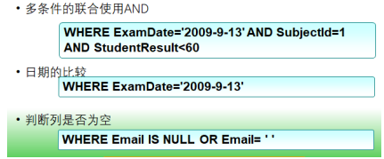

### ORACLE 

数据库系统是美国 ORACLE 公司（甲骨文）提供的以分布式数据库为核心的 一组软件产品，是目前最流行的客户/服务器(CLIENT/SERVER)或 B/S 体系结构的数据库之 一。ORACLE 数据库是目前世界上使用最为广泛的数据库管理系统，作为一个通用的数据 库系统，它具有完整的数据管理功能；作为一个关系数据库，它是一个完备关系的产品；作 为分布式数据库它实现了分布式处理功能。

■ 可用性强 ■ 可扩展性强 ■ 数据安全性强 ■ 稳定性强


新建表空间的时候，一定要声明如果达到了指定的大小，再继续自动增长； 

```
create tablespace qmys datafile 'D:\min_orcl_data\XSYH.DBF' size 500m  autoextend on next 100m maxsize unlimited;
```

  如果忘记了指定自动增长数据，可以再修改： 

```
alter database datafile 'D:\min_orcl_data\XSYH.DBF' autoextend on;
```


3.创建用户语句：

```sql
create user xsyh identified by xsyh default tablespace xsyhSpace;--创建用户； 
```

4.给创建的新用户授权，否则无法登录连接数据库；

```sql
grant dba to xsyh; --授权
```

5.授权或撤销授权的语法：

```sql
GRANT privileges or role TO user; #分配权限或角色 

REVOKE privileges or role FROM user; #撤销权限或角色
```


# 用新账号登录数据库，注意角色是普通用户。然后可以创建一张用户表：


```
-- Create table 
create table MY_USER ( 
 USERID NUMBER, 
 USERNAME VARCHAR2(20), 
 USERPWD VARCHAR2(10), 
 USERROLE NUMBER, 
 USERAGE NUMBER 
) 

-- Add comments to the table  
comment on table MY_USER is '用户表';

-- Add comments to the columns  
comment on column MY_USER.USERID is '用户ID'; 
comment on column MY_USER.USERNAME is '用户名'; 
comment on column MY_USER.USERPWD is '用户密码'; 
comment on column MY_USER.USERROLE is '用户角色'; 
comment on column MY_USER.USERAGE is '用户年龄';
```


/* 这是多行注释；

1.非空约束：如果勾选了可为空，表示可以为空，如果取消勾选，表 示不能为空； 

2.主键约束：此列为主键，默认不能为空； 肯此列不能重复； 

3.唯一约束：此列不能重复； 

4.检查约束：此列必须满足一定的条件，才可以输入进来。 

user_age between 18 and 60 

user_add in ('北京','上海','广州','深圳')

*/


# Oracle 数据库的数据类型：

①整数类型；

​	NUMBER 类型：定义格式 NUMBER (precision,scale)，取值范围为【1-38】 默认 38，NUMBER 整数部分允许的长度为（precision- scale）。

​	关于 number 的精度(p)和刻度(s)遵循以下规则： 

​		1) 当一个数的整数部分的长度> p-s 时，Oracle 就会报错 

​		2) 当一个数的小数部分的长度> s 时，Oracle 就会舍入。 


②字符串类型：

​	字符串数据类型还可以依据存储空间分为固定长度类型（CHAR/NCHAR) 和可变长度类 型（VARCHAR2/NVARCHAR2)两种.

​		所谓固定长度：

​	是指虽然输入的字段值小于该字段的限制长度，但是实际存储数据时，会先自动向右补足 空格后，才将字段值的内容存储到数据块中。

这种方式虽然比较浪费空间，但是存储效率较可变长度类型 要好。 

​		所谓可变长度：

​	是指当输入的字段值小于该字段的限制长度时，直接将字段值的内容存储到数据块中，而 不会补上空白，这样可以节省数据块空间。


CHAR：存储固定长度的字符串，最大长度 2000 bytes  

VARCHAR2 ：存储可变长度的字符串 ，最大长度 4000 bytes 

NCHAR 和 NVARCHAR2 ：存储 Unicode 字符集类型。 

NCHAR: 最大长度 2000 bytes,

NVCHAR2: 最大长度 4000 bytes


注意： 

1. VARCHAR2 比 VARCHAR 更适合使用，由于兼容性的原因，所以仍然在 Oracle 数据库中保留着 VARCHAR 。

2. 用于存储 raw 类型的二进制数据。最多可以存储 2000B。建议使用 BLOB 来代替它。

3. 用于存储 raw 类型的二进制数据。最多可以存储 2GB 的数据。建议使用 BLOB 来代替它。

4. 不建议使用 VARCHAR、 INTEGER、FLOAT、DOUBLE 等类型 

5. DATE：存储日期和时间数据 

6. TIMESTAMP：比 DATE 更精确 

7. BLOB：存储二进制对象，如图像、音频和视频文件 

8. CLOB：存储字符格式的大型对象


# Oracle 没有类似 mysql 的 auto increatement 定义自增长，但是可以定义一个序列 sequence，然后在插入数据时取序列中的下一个值即可。


# Sql 语句 

数据定义语言 DDL：create、alter、drop 

数据操纵语言 DML：insert、delete、update、select 

事务控制语言 TCL：commit、savepoint、rollback 

数据控制语言 DCL：grant、revoke


```
create table STUDENTS
(
	SNAME VARCHAR2(20), 
	SGRADE NUMBER(2), 
	SSEX NUMBER(1) 
) 
-- Add comments to the table  
comment on table STUDENTS is '学生信息表';
```





# 运算符

一种符号,它是用来进行列间或者变量之间的比较和数学运算的

算术运算符、赋值运算符、比较运算符、逻辑运算符

```
+  	加运算,求两个数或表达式相加的和,如6+8

-   减运算,求两个数或表达式相减的差

* 	 乘运算,求两个数或表达式相乘的积

/    除运算,求两个数或表达式相除的商,如5/3的值为1

=    等于,例如: age=23

>	 大于,例如: price>100

<    小于

<>   不等于

>=   大于等于

<=    小于等于
```


