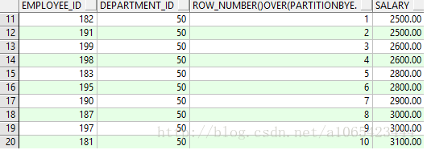
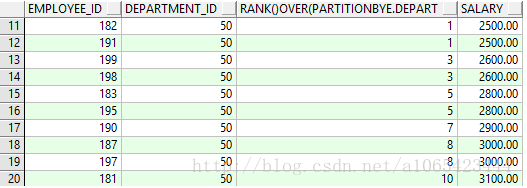
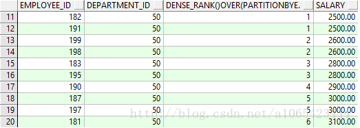
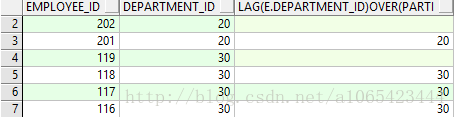
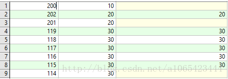
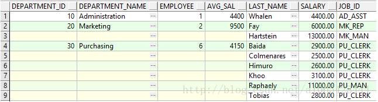
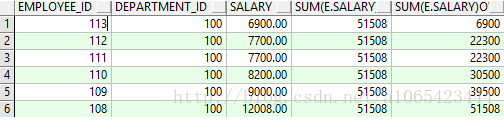
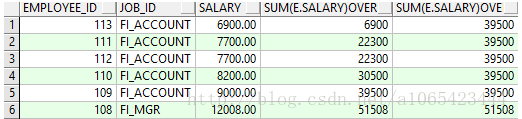

# over()分析函数

- 开窗函数over()，包含三个分析子句:

分组(partition by)
 排序(order by)
 窗口(rows)

说明：聚合函数（如`sum()`、`max()`等）可以计算基于组的某种聚合值，但是`聚合函数`对于某个组`只能返回一行记录`。若想对于某组返回`多行记录`，则需要使用分析函数

#### over()函数写法

over(partition by expr2 order by expr3)，根据expr2对结果进行分区，在各分区内按照expr3进行排序； 

## *over函数不能单独使用，需要与row_number()，rank()和dense_rank，lag()和lead(),sum()等配合使用。*

##### 分区partiton by 与 group by的区别 

group by会将结果集按照指定字段进行聚合，结果集会缩减，在统计部门人数，平均工资时会用到； 
partition by会对结果集按照指定字段分层排列，结果集不会缩减，如将公司所有人按照部门进行分区，会发现结果集中同一部门的人会连续排列。

根据配合使用的函数情况的不同，分层次介绍： 
\- row_number()，rank()，dense_rank() 
\- lag()与lead() 
\- sum()

#### 1、与row_number()，rank()，dense_rank()的使用

这三个函数与over连用时order by 不能丢失，不写partition by时默认结果集为一整个分区。 
row_number()与over(partition exp2 order by exp3)配合使用可以对分区根据exp1进行排序，此排序是从1开始，即使遇到相同的数据，也区分开来排序。

```
SELECT e.employee_id,
       e.department_id,
       row_number() over(PARTITION BY e.department_id ORDER BY e.salary),
       e.salary
  FROM employees e;
```



rank()与over(partition exp2 order by exp3)配合使用可以对分区根据exp3进行可并列排序，此排序是从1开始，遇到相同的数据，会排成同一名，排名可能不连续。

```
SELECT e.employee_id,
       e.department_id,
       rank() over(PARTITION BY e.department_id ORDER BY e.salary),
       e.salary
  FROM employees e;
```



dense_rank()表示每一条数据在所属分区的等级

```
SELECT e.employee_id,
       e.department_id,
       dense_rank() over(PARTITION BY e.department_id ORDER BY e.salary),
       e.salary
  FROM employees e;
```



#### 2、与lag()与lead()的使用

这两个函数与over连用时order by 不能丢失，不写partition by时默认结果集为一整个分区。 

```
lag(expr1) over(partiton by expr2 order by expr3) 
```

在分区内获取前一行数据的expr1字段的值，第一行为空（第一行无前一行）

```
SELECT e.employee_id,
       e.department_id,
       lag(e.department_id) over(PARTITION BY e.department_id ORDER BY e.salary) 
  FROM employees e;
 
lead(expr1) over(partiton by expr2 order by expr3) 
```



在分区内获取后一行数据的expr1字段的值，最后一行为空（最后一行无后一行）

```
SELECT e.employee_id,
       e.department_id,
       lead(e.department_id) over(PARTITION BY e.department_id ORDER BY e.salary)
  FROM employees e;
```


在此作用不太明显，但是若配合decode等来使用，会有不一样的效果，如可以将分区内重复的结果数据置为空。 
结果如下： 
 
代码如下：

```
SELECT decode(department, NULL, t.department_id, NULL) department_id,
       decode(department, NULL, d.department_name, NULL) department_name,
       decode(department, NULL, t.employee, NULL) employee,
       decode(department, NULL, t.avg_s, NULL) avg_sal,
       t.last_name,
       t.salary,
       t.job_id
  FROM departments d,
       (SELECT e.department_id,
               e.last_name,
               e.salary,
               e.job_id,
               avgs.avg_s,
               avgs.employee,
               lag(e.department_id) over(PARTITION BY e.department_id ORDER BY e.last_name) department --用于判断的别名
          FROM employees e,
               (SELECT e2.department_id, --部门工资平均值与部门人数
                       trunc(AVG(e2.salary), 2) avg_s,
                       COUNT(*) employee
                  FROM employees e2
                 GROUP BY e2.department_id) avgs
         WHERE e.department_id = avgs.department_id) t
 WHERE d.department_id = t.department_id;
```

#### 3、与sum()的使用

sum()与over连用时order by 可以不写，不写partition by时默认结果集为一整个分区；需要特别注意的是，此处的sum不是求整个分区的和，而是按照order  by expr3字段进行分层后，求出分区中小于等于自身所在分层等级的和，即连续求和。 

```
sum(expr1) over(partition by expr2 order by expr3)
```

不写order by字段，默认整个分区属于同一层 
多个sum() over()连用时，分区只按照顺序出现的第一个order by进行排序；每个sum()计算的值，按自身的order by进行分层后计算，类似于使用一个子查询进行计算。

```
 SELECT e.employee_id,
        e.department_id,
        e.salary,
        SUM(e.salary) over(PARTITION BY e.department_id),
        SUM(e.salary) over(PARTITION BY e.department_id ORDER BY e.salary)
   FROM employees e
  WHERE e.department_id = 100;
```



此时按照的是第二个sum+over的order by e.salary字段对分区进行的排序。（第一个sum+over无order by 字段） 
对于第一个sum+over，默认为所有成员在同一层，所以第四列的值全为分区员工工资总和。

 

```
SELECT e.employee_id,
        e.job_id,
        e.salary,
        SUM(e.salary) over(PARTITION BY e.department_id ORDER BY e.salary),
        SUM(e.salary) over(PARTITION BY e.department_id ORDER BY e.job_id)
   FROM employees e
  WHERE e.department_id = 100;
```



此处结果集按照第一个sum+over的order by  e.salary进行排序，第五列的结果是按照e.job_id进行分层后连续求和得到的，第一层job_id=FI_ACCOUNT,共五个，所以那五行的第五列结果都为第一层的和；job_id=FI_MGR属于按job_id分层的第二层，所以计算结果为第一层+第二层的连续求和。


```
窗口则是表示分析函数的作用范围，默认范围是组内所有记录，即：

SUM(SAL) OVER(PARTITION BY E.DEPTNO 
                             ORDER BY E.SAL)
相当于
SUM(SAL) OVER(PARTITION BY E.DEPTNO 
              ORDER BY E.SAL
              ROWS BETWEEN UNBOUNDED PRECEDING AND UNBOUNDED FOLLOWING)
```

### 其它表示范围的写法还有：

第一行至当前行：

```
ROWS BETWEEN UNBOUNDED PRECEDING AND CURRENT ROW
```

当前行至最后一行：

```
ROWS BETWEEN CURRENT ROW AND UNBOUNDED FOLLOWING
```

当前行的上一行(rownum-1)到当前行：

```
ROWS BETWEEN 1 PRECEDING AND CURRENT ROW
```

当前行的上一行(rownum-1)到当前行的下辆行(rownum+2)：

```
ROWS BETWEEN 1 PRECEDING AND 2 FOLLOWING
```

